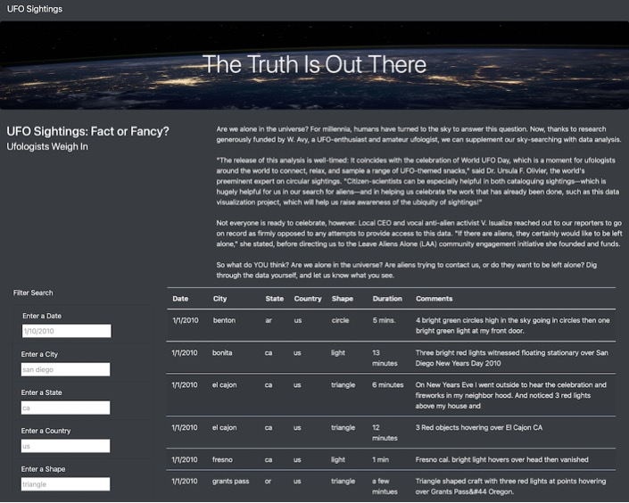
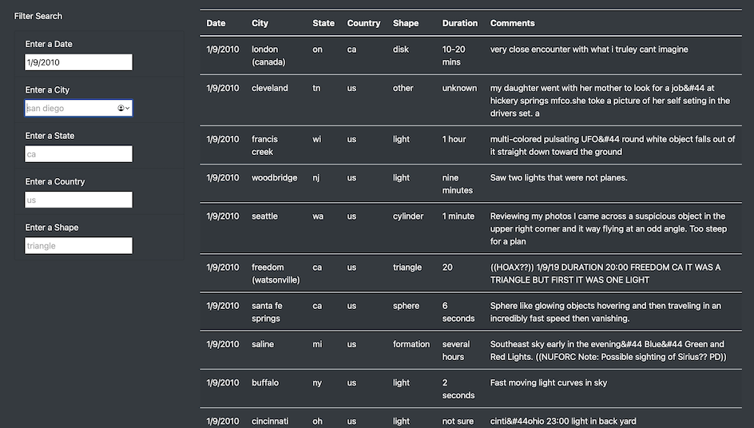
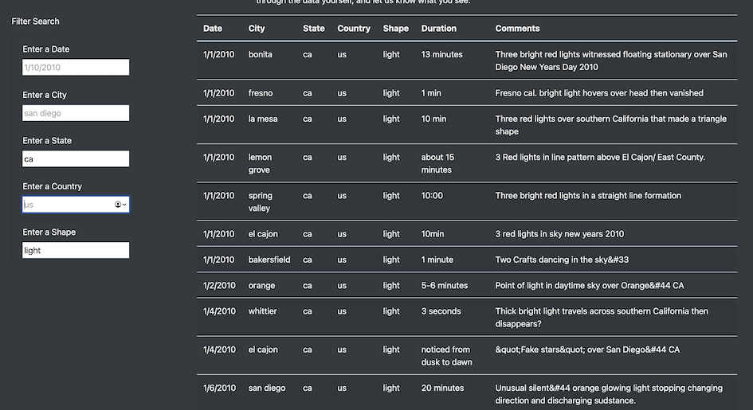

# UFO Sightings

## Overview
The purpose of this project is to create a webpage that will read and display a table of UFO sightings.  Users can choose to filter the table by any or all these choices: date, city, state, country or shape of the object.  

## Project Set Up
The project uses 4 files and an image.
1. An HTML file for the webpage.  This file includes Bootstrap elements which help to provide structure and color to the page.  The main elements include:
   - A Header
   - Jumbotron
   - Text
   - Form element to hold a list of input boxes on which the user can choose to filter the data
   - Table element for the data
2. Cascading style sheet, CSS, is used to style two elements of the page:
   - The body color is set to #f7f7f7 which is Lynx White
   - The jumbotron uses the background image nasa.jpg, the image is set to cover the entire area of the element and the text inside aligned to the center
3. The data file which was provided for the project and contains an array of objects.  An example of an object is as follows:
```
{
    datetime: "1/1/2010",
    city: "benton",
    state: "ar",
    country: "us",
    shape: "circle",
    durationMinutes: "5 mins.",
    comments: "4 bright green circles high in the sky going in circles then one bright green light at my front door."
  }
```
4. The javascript file which provides the code that will do the following:
   - Detect a change to any of the filters in the form
   - Display the full listing of the data file
   - If a change is detected to a filter, update the display to show only data matching the criteria.
   - A __filters__ object holds the key of which filter was changed, ie date, city, state, country or shape.   The value is the user input.
   - The updated __filters__ object key and value is then used to rewrite the table data.  The code to do that is here:
```
  function filterTable() {
    let filteredData = tableData;
   
    for (key in filters){
      filteredData = filteredData.filter(row => row[key] === filters[key]);
    };
  
    buildTable(filteredData);
  }
```

## Results:
When a user enters information into any of the filter fields and then moves the cursor to another field the table is updated. Here is what the initial index.html page looks like to the user.  Notice the text in the filter boxes.  This is text that has been added in the html file as placeholder text to give the user a sense of what is expected.

 
 
If the user enters for example a date, the table changes to show only the items with the date entered. Like this:



Another example here shows how if the state and the shape are added to the form:



What you don't see is that if first the state changes the table changes to reflect the listing to show only those sightings for that state.  The shape filters the table down again to provide the output seen above.


## Summary:
There are a few drawbacks to the this analysis that would take addition work and further development to implement.

### Drawbacks:
One of the primary drawbacks is that the search criteria is case sensitive.  Entering CA for California yields empty results.  Whereas ca shows all sightings in California.

Another is the inability to sort the data.  If for example I wanted to find all the sightings for a triangle shape I get the results in an ascending order but cannot change it to a descending order.

Also the text above the table does not provide information on the dates of the information.  It would be a simple matter to add a line that states that this date is from January 1, 2010 to January 13, 2010.  That way the user doesn't input a date beyond the data set.

### Recommendations
The reccomendations would follow from the drawbacks:
1. Add in the app.js file a .toLowerCase() method for the value from the form input.  This will allow the user to enter their criteria with upper or lower case.
2. Add sorting functions to the table so that data can be sorted ascending or descending. 
3. Add more information in the paragraph above the table to explain to the user the time frame of the data.
